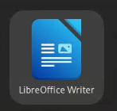

# Open a New Document in Libreoffice
### Libreoffice, 24.2.0.3, Fedora Linux
1. Click the Libreoffice Icon 
 

#### Outside Resources
- [Libreoffice Writer support page](https://nextcloud.documentfoundation.org/s/JZPbqLcjYt4oayD)
